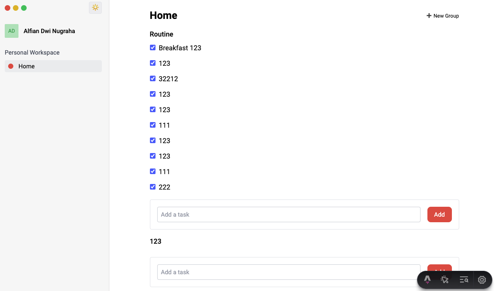

# 📑 tugasin
a simple To do list app with Astrojs (astro + vue) for frontend and Hono for backend.

## Features
- Multiple project space
- Multiple group
- Multiple task

## Tech Stack
- Frontend: [Astro](https://astro.build/)
- Backend: [Hono](https://hono.dev/)
- ORM: [Prisma](https://www.prisma.io/)
- Database: [PostgreSQL](https://www.postgresql.org)
- Development Tools: [Docker](https://www.docker.com)

## Libraries used
- [prisma](https://www.prisma.io/)
- [@astrojs/vue](https://docs.astro.build/en/guides/integrations-guide/vue/)
- [@astrojs/tailwind](https://docs.astro.build/en/guides/integrations-guide/tailwind/)
- [nanostores](https://github.com/nanostores/nanostores)